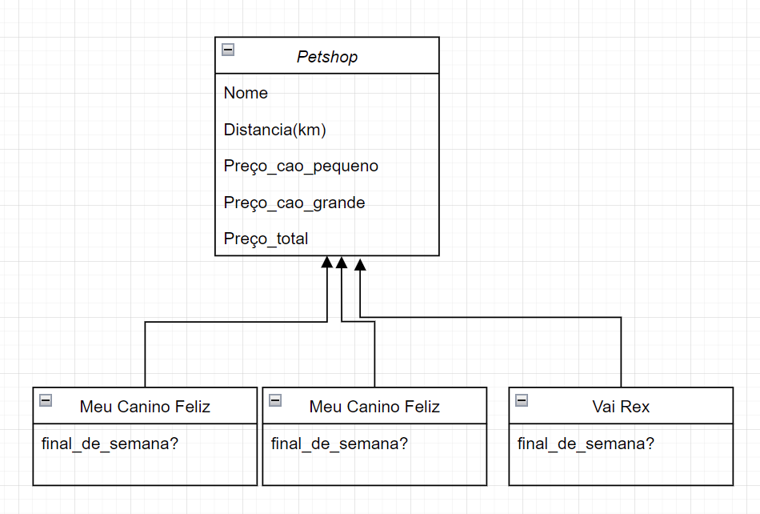

# *Petshop*

A atividade foi desenvolvida utilizando a linguagem *Java*, basicamente a esolha surgiu pela praticidade tendo como
base o seu paradigma orientado á objeto onde temos nossa entidade mãe e as outras classes que herdam os seus metodos.

<p align="center"></p>

A implementação da classe abstrata foi realizado no arquivo [Petshos.java](https://github.com/Javiercuba/TesteDTI/blob/main/src/com/company/Petshop.java)
# *Decisões de projeto*
Na implementação da atividade foi pensado cada petshop como uma entidade.

O codigo abaixo é um exemplo de uma das classes que inicializa o construtor da classe mãe com seus valores especificos.

   ```java
   public class MeuCaninoFeliz extends Petshop{
    public MeuCaninoFeliz(boolean final_de_semana) {
        super(2, final_de_semana?(48):40, final_de_semana?(24):20.00,"Meu Canino Feliz");
    }
}
   ```
Foi pensado dessa maneira para poder deixar de forma mais asbtrata na hora de realizar as manipulações de calculo e comparação 
do preço final de cada Petshop na função ``CalculaValorTotal``

```java
static void CalculaValorTotal(List<Petshop> petshops,int caes_grandes, int caes_pequenos){
    for(Petshop petshop:petshops){
        //Inserindo O valor total para cada classe
        petshop.setPrecoTotal(caes_grandes,caes_pequenos);
        }
  //Organizando em função do preço e distancia
  petshops.sort(Comparator.comparing(Petshop::getPrecoTotal).thenComparing(Petshop::getDistancia_km));
}
```


# *Main.java*

Nesse arquivo além de ser onde é feito todas as entradas do input do console também é feito os seguintes passos:

* Inicialização das intancias:

```java
  Petshop CaninoFeliz = new MeuCaninoFeliz(isFinal_de_semana(selected_date));
  Petshop VaiRex      = new VaiRex(isFinal_de_semana(selected_date));
  Petshop ChowChawgas = new ChowChawgas();
```

* Utilização de duas funções auxiliares:

    *1. Retorna true ou false dependendo do dia da semana*
    ```java
    static boolean isFinal_de_semana(String data)
    ```

    *2. Calcula o preço total em cada petshop e retorna o mais em conta*
    ```java
    static void CalculaValorTotal(List<Petshop> petshops,int caes_grandes, int caes_pequenos)
    ```  

# Execução do Sistema
Para realizar a execução do sistema é necessario ter o JDK e a JVM instalado na máquina, clonar o repositório e executar o arquivo [main.java](https://github.com/Javiercuba/TesteDTI/blob/main/src/com/company/Main.java)

 

